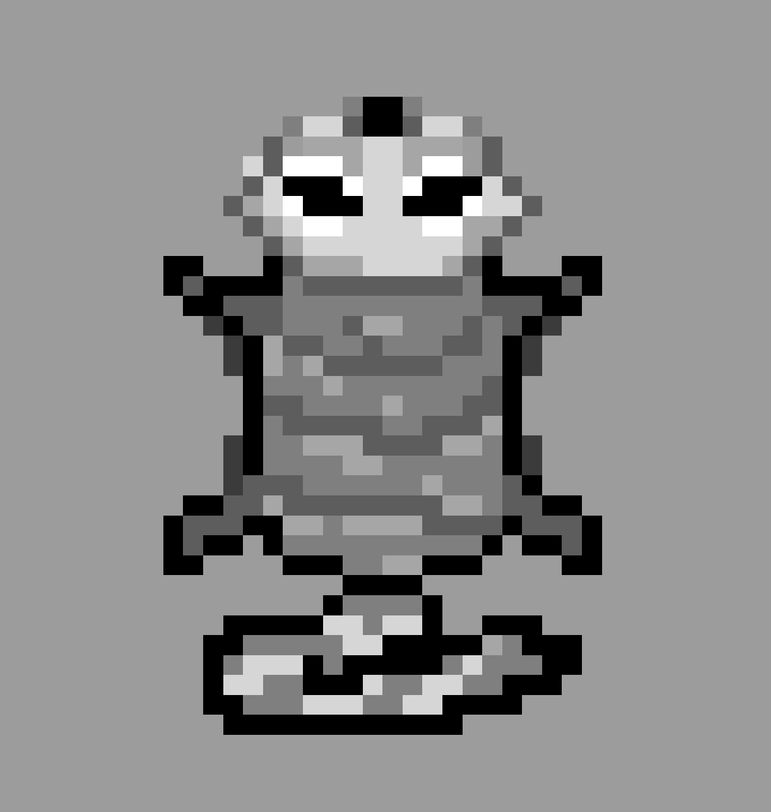

# Frogger - Team 2

[Frogger](https://en.wikipedia.org/wiki/Frogger) is a classic arcade game originally developed by [Konami](https://en.wikipedia.org/Konami) in 1981. The game's goal is to guide a frog from the bottom of the screen to its home at the top, avoiding moving obstacles along the way.

### Content Table

- [Gameplay](#gameplay)
  - [1. Goal](#1-goal)
  - [2. Controls](#2-controls)
  - [3. Game Mechanics](#3-game-mechanics)
  - [4. Levels and Difficulty](#4-levels-and-difficulty)
- [Technologies used](#technologies-used)
  - [Hardware Requirements](#hardware-requirements)
  - [Software Requirements](#software-requirements)
  - [Device](#device)
  - [Language](#language)
- [Designs and Visuals](#designs-and-visuals)
  - [Player character : Raccoon](#player-character--raccoon-32x32-pixels)
  - [Obstacles : Trash Trucks](#obstalces--trash-tucks-64x32-pixels)

## Gameplay

#### 1. Goal

The player controls a frog, navigating it through multiple hazards, such as moving cars. The primary goal is to reach the frog’s home at the top of the screen without being hit by a car. 

#### 2. Controls

The player uses directional controls (up, down, left, right) to move the frog. The frog can move one step at a time, with each step taking it closer to its destination. Switches of the board will be used to control the frog 

 SW2 = Left ; SW4 = Right ; SW1 = Up ; SW3 = Down 

#### 3. Game Mechanics

- **Welcome Screen**: Once the game has been launched, the welcome screen appears, with a 'Start' button allowing the player to start a new game.

- **Starting zone**: The bottom of the screen, serves as starting area for every level, which is equivalent to a row in terms of size, and this row is obstacle-free.

- **Travel Mechanic**: The player must hop onto safe spaces, those who remains free of vehicles for a short period of time, to travel across the map.

- **Road Traffic**: Vehicles move horizontally across the screen, from left to right or conversely, and their amount and speed can vary from one row to another. But in the same row, different vehicules cannot have different travel speeds. Colliding with any of them will result in losing the game and displaying the game over's screen.

- **Game Over**: When the player loses, the game over's screen and a restart button will be displayed. Pressing the restart button will launch a new game and bring back the player to the first level.

- **Home Spaces**: At the top of the screen are safe spaces where the frog must land to complete each level. Completing a level allows the player to earn points and send him to the starting zone of the next level.

- **Points**: Points are earned by finishing a level, they accumulate along the game, resulting in the final score of each game.

#### 4. Levels and Difficulty

As the player progresses through the levels, speed and difficulty increase. Vehicles move faster and obstacles become harder to avoid.

## Technologies used

### Hardware Requirements

- **FPGA Board**: A suitable FPGA development board.

- **Input/Output Devices**: Switches from FPGA's board, VGA output for video display.

- **Power Supply**: Reliable power source with proper voltage regulation.

- **Testing Equipment**: Logic analyzer, oscilloscope, or simulation probes for hardware debugging.

### Software Requirements

- **Simulation Tools**: For testing game mechanics before hardware deployment.

- **Synthesis & Implementation Tools**: To compile and synthesize the design for the FPGA.

- **Version Control System**: GitHub or equivalent platform for collaboration and version tracking.

### Device

For this project, an **FPGA (Field Programmable Gate Array)** is used. An FPGA is a powerful hardware device that allows for the implementation of custom digital circuits. In this project, the FPGA will handle the core mechanics of the Frogger game, including rendering the screen, processing inputs from controls, and managing game states (such as traffic movement, collision detection, and score tracking). The flexibility of an FPGA allows for highly optimized real-time performance and parallel processing, making it ideal for a game like Frogger. The FPGA has a VGA port that's used to display the game on a screen.

### Language

Since an FPGA is used, **Verilog** has been chosen to code the game. Verilog is a hardware description language (HDL) that enables us to design and simulate the digital circuits needed to implement Frogger's mechanics. With Verilog, we can define how the game logic behaves, such as how the frog moves, how the traffic progresses, and how collisions are detected. These behaviors are then transferred into the FPGA as hardware circuits, enabling fast and efficient execution of the game on the FPGA device.

## Designs and Visuals

### Player character : Raccoon (32x32 pixels)

### Obstacles : Trash Trucks (64x32 pixels)

