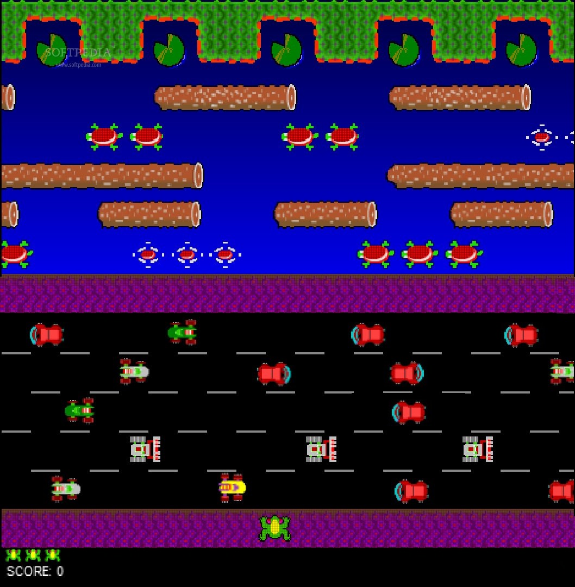

### **Functional Specifications for "Frogger" Game Recreation**

### Content Table

1. [Introduction](#1-introduction)
2. [Game Overview](#2-game-overview)
3. [Game Mechanics](#3-game-mechanics)
    - [Movement and Controls](#31-movement-and-controls)
    - [Obstacles and Hazards](#32-obstacles-and-hazards)
    - [Timer and Score](#33-timer-and-score)
    - [Winning and Losing Conditions](#34-winning-and-losing-conditions)
4. [Levels and Progression](#4-levels-and-progression)
5. [User Interface (UI)](#5-user-interface-ui)
    - [Main Menu](#51-main-menu)
    - [In-Game HUD](#52-in-game-hud)
    - [Game Over HUD](#53-game-over-hud)
6. [Game Modes](#6-game-modes)
7. [Sound and Music](#7-sound-and-music)
8. [Graphics and Animation](#8-graphics-and-animation)
9. [Platform Compatibility](#9-platform-compatibility)
10. [Updates and Expansions](#11-updates-and-expansions)
11. [Data Handling](#12-data-handling)

 
 

## **1. Introduction**

The purpose of this document is to outline the functional specifications for the recreation of the classic *Frogger* game. It details all the functionalities, features, and interactions that the game will encompass. This document aims to answer every potential "what" question regarding the game design and structure.

 
 

## **2. Game Overview**

**What is Frogger?**

Frogger is an arcade-style game where the player controls a frog that must make its way across a busy road and river to reach the other side safely. The objective is to avoid obstacles and reach the goal within a certain time.

**What is the main goal of the game?**

The goal of the game is to guide the frog from the bottom of the screen to a safe destination at the top, avoiding obstacles such as cars, trucks, and hazards in the river, and reaching the final "home" spaces.

**What are the visuals of the original version?**

For comparison purposes, let's introduce the original game desgins :

**Description of the map and mecanics (from bottom to top):**

- The first purple zone is the starting zone, nothing can harm the frog here.

- The road is crossed horizontaly by multiple obstacles (from left to right or inversly). If the frog hit an obstacle, a life is lost.

- The second purple zone is a safe zone, nothing can harm the frog here one again. It serves as transition from road to river.

- In the river, it is the opposite mechanic. The frog need to use the turtules shells and logs to cross the river. Some of the shells temporarily disappear. If the frog fall in the water, a life is lost. 

- The last has the water lilys that serves as checkpoints. The frog must land on each of them to complet the whole level. If landed on the cactus, a life is lost.

**What we decided to change compared to the original game?**

The player will now play a little raccoon, and all the basic concepts of the frogger, will be translated to fit with the raccoon. 

 
 

## **3. Game Mechanics**

### **3.1 Movement and Controls**

**What controls are available to the player?**

- Players can move the raccoon up, down, left, or right using the switches of the board.

**What happens when the player moves the frog?**

- The raccoon moves one step in the chosen direction, and if the switch is maintained, the raccoon will pursue his way in the choosen direction until the switch is released.

**What restrictions are there on movement?**

- The raccoon cannot move off the screen.
- Movement are restricted based on obstacles such as traffic, water, and boundaries.
- The raccoon cannot move in other ways than that : top, bottom, right and left.

 

### **3.2 Obstacles and Hazards**

**What types of obstacles are there?**

1. **Traffic:**
    - Cars, garbage trucks, and school buses move horizontally across the screen in predefined lanes.
2. <s>**River Hazards:**
    - <s>Water is an instant hazard where the frog will drown unless standing on a floating object, as logs and trurtules.</s>
    - <s>Logs and turtles float on the river, allowing safe passage if timed correctly.</s>

**What happens when the frog encounters an obstacle?**

- If the frog touches a vehicle the player loses a life, and the frog returns to the start of the level (5 rounds).

 

### **3.3 Timer and Score**

**What is the purpose of the timer?**

- Each level has a time limit (60 seconds), requiring the player to move quickly to complete the level.

**What happens when the timer reaches zero?**

- The player will lose a life if the timer runs out before the frog reaches the destination.

**What scoring system is implemented?**

- Points are awarded for successfully completing a level.

 

### **3.4 Winning and Losing Conditions**

**What are the win conditions?**

- The player wins the level when all frogs safely reach the designated "home" spots at the top of the screen. Those 5 "homes" are represented by trashes. To complete a level, the player has to reach the five trashes.

**What are the losing conditions?**

- The player loses a life if they:
    - Get hit by a vehicle.
    - Fall into the river.
    - Run out of time.
    - Land in a non-home space at the top of the screen (the worksite barriers).
- The game is over when the 5 lives are lost.

 
 

## **4. Levels and Progression**

**What defines a level in the game?**

- A level consists of a road section with moving vehicles. <s>and a river section with floating logs, turtles, and hazards.</s> At the top of the screen are water  slots where the frog must reach.

**What changes between levels?**

- **Traffic Speed and Volume:** Vehicles number increase (up to 16 at the same time on the screen), at the same time as their movement speed.
- **River Difficulty:** The speed of logs/turtles increases, and gaps between safe zones may become larger.

**What happens after the player completes a level?**

- The player proceeds to the next level, which increases in difficulty. The game continues until the player runs out of lives. Reaching the next level does not restore lives.

 
 

## **5. User Interface (UI)**

### **5.1 Main Menu**

**What options are available in the main menu?**

- Start Game
- Highest Scores

**What does each option in the menu do?**

- **Start Game:** Launches the game from the first level.
- **High Scores:** Displays a leaderboard of top scores.

---

### **5.2 In-Game HUD**

**What information is displayed during gameplay?**

- **Score:** Shows the player’s current score.
- **Lives:** Displays the remaining lives (e.g. 3 bars).
- **Timer:** Shows the remaining time to complete the level.
- **Level Indicator:** Displays the current level.
- **Home Slots:** Indicates which home slots have been filled. Each reached trash will contain a raccoon, and those that not will remain empty.

**What happens when the HUD elements change?**

- **Lives Decrease:** The frog icon in the lives indicator will disappear.
- **Score Increase:** The score number updates with every successful action (crossing lanes, reaching home slots, finishing a level).
- **Timer Countdown:** The timer decreases in real time and alerts the player when time is nearly out, by turning red from 10 seconds left.

### **5.3 Game Over HUD**

**What will be on the game over screen ?**

- **Score of the current game**: Shows how many point the player scored this game
- **Highest score**: The highest score ever realised on the game, serves as comparative data between the score of the current game.
- **Restart button**: Allows the player to restart a new game.

 
 

## **6. Game Modes**

**What game modes are available?**

**Classic Mode:**
    - A recreation of the original arcade-style Frogger, featuring progressively harder levels and fixed obstacles.

 
 

## **8. Graphics and Animation**

**What is the graphical style of the game?**

- A pixel art art style to mimic the retro look of the original Frogger.

 
 

## **9. Platform Compatibility**

**What platforms will the game support?**

- <b>FPGA</b>s with at least a power supply and a VGA port

 
 

## **11. Updates and Expansions**

**What additional features can be implemented?**

**Gamemodes**
- **Multiplayer (local)**: Adding a multiplayer mode may be a good thing to add competition. But that entails to had external hardware, like a keyboard or controlle

**Graphical animations**
- **Jumping animation**: An animation (from 6 to 8 frames) of the raccoon while jumping in different directions.
- **Death animation**: A better designed death animation (from 2 to 4 frames)

**Customization and options**
- **Skins**: adding other raccoon skins (christmas raccoon, halloween raccoon, radioactive raccoon, rocket raccoon...)
- **Maps**: adding other maps (Zone 52, Space base...)

1. **Power-ups:**
    - Items such as "invincibility" for a short duration or "speed boost" can appear randomly in levels.
2. **Character Customization:**
    - Players can unlock different frog skins or costumes by achieving certain scores or completing levels.
3. **Achievements/Trophies:**
    - The game can include a set of achievements for players to unlock, like "First Time Survivor" or "Speed Demon."

**What content updates are planned post-launch?**

- New levels with unique themes (e.g., different terrains like deserts, jungles).
- Seasonal or holiday-themed events with limited-time challenges or aesthetics.

 
 

## **12. Data Handling**

**What data is stored in the game?**

- **Highest score**: the highest score has to be stored to add a virtual checkpoint for the player. Then he knows how far he's from his best score.

#### Glossary## **11. Updates and Expansions**

**What additional features can be implemented?**

**Gamemodes**
- **Multiplayer (local)**: Adding a multiplayer mode may be a good thing to add competition. But that entails to had external hardware, like a keyboard or controlle

**Muics and Sound Effects**
- **Backgorund music**: An upbeat, arcade-style track that plays during gameplay.
- **Home reached**: A litte sound to indecate that a safe zone has been reached.
- **Level completion sound**: An jingle that start when the player succeed to finish a level.

**Graphical animations**
- **Jumping animation**: An animation (from 6 to 8 frames) of the raccoon while jumping in different directions.
- **Death animation**: A better designed death animation (from 2 to 4 frames)

**Customization and options**
- **Skins**: adding other raccoon skins (christmas raccoon, halloween raccoon, radioactive raccoon, rocket raccoon...)
- **Maps**: adding other maps (Zone 52, Space base...)

1. **Power-ups:**
    - Items such as "invincibility" for a short duration or "speed boost" can appear randomly in levels.
2. **Character Customization:**
    - Players can unlock different frog skins or costumes by achieving certain scores or completing levels.
3. **Achievements/Trophies:**
    - The game can include a set of achievements for players to unlock, like "First Time Survivor" or "Speed Demon."

**What content updates are planned post-launch?**

- New levels with unique themes (e.g., different terrains like deserts, jungles).
- Seasonal or holiday-themed events with limited-time challenges or aesthetics.

 
 

## **11. Updates and Expansions**

**What additional features can be implemented?**

**Gamemodes**
- **Multiplayer (local)**: Adding a multiplayer mode may be a good thing to add competition. But that entails to had external hardware, like a keyboard or controlle

**Muics and Sound Effects**
- **Backgorund music**: An upbeat, arcade-style track that plays during gameplay.
- **Home reached**: A litte sound to indecate that a safe zone has been reached.
- **Level completion sound**: An jingle that start when the player succeed to finish a level.

**Graphical animations**
- **Jumping animation**: An animation (from 6 to 8 frames) of the raccoon while jumping in different directions.
- **Death animation**: A better designed death animation (from 2 to 4 frames)

**Customization and options**
- **Skins**: adding other raccoon skins (christmas raccoon, halloween raccoon, radioactive raccoon, rocket raccoon...)
- **Maps**: adding other maps (Zone 52, Space base...)

1. **Power-ups:**
    - Items such as "invincibility" for a short duration or "speed boost" can appear randomly in levels.
2. **Character Customization:**
    - Players can unlock different frog skins or costumes by achieving certain scores or completing levels.
3. **Achievements/Trophies:**
    - The game can include a set of achievements for players to unlock, like "First Time Survivor" or "Speed Demon."

**What content updates are planned post-launch?**

- New levels with unique themes (e.g., different terrains like deserts, jungles).
- Seasonal or holiday-themed events with limited-time challenges or aesthetics.

 
 

### Glossary

<b>Arcade-style game:</b> 
- A type of video game designed to be simple and straightforward, often featuring fast-paced action and short levels, inspired by games commonly found in amusement arcades.

<b>FPGA (Field-Programmable Gate Array):</b> 
- A type of integrated circuit that can be configured by the user or designer after manufacturing, often used in specialized gaming platforms.

<b>HUD (Heads-Up Display):</b> 
- On-screen display elements that provide the player with information during gameplay, such as score, time, and remaining lives.

<b>Pixel Art:</b> 
- A type of digital art where images are created and edited at the pixel level, often associated with retro-style video games for a nostalgic or minimalist look.

<b>Predefined lanes:</b> 
- Specific paths on which objects (such as cars or trucks) move within a fixed or set pattern.

<b>Power-ups:</b> 
- Items that temporarily grant players special abilities, such as invincibility or speed boosts, enhancing the gameplay experience.

<b>Upbeat, arcade-style track:</b> 
- Fast-paced, energetic background music that complements the retro arcade gaming experience.

<b>VGA (Video Graphics Array) port:</b> 
- A connector commonly used to transmit video signals from a device (such as an FPGA) to a monitor or display.