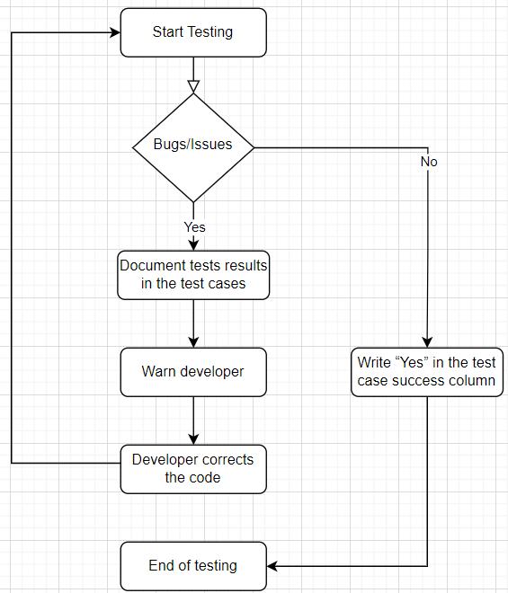

# Test Plan

---

**Project** : Frogger  
**Team** : 2  
**Created by** : Enoal ADAM  
**Creation Date** : 09/26/2024  
**Updated** : 20/11/2024  

---

Table of content

- [Test Plan](#test-plan)
  - [1. Introduction](#1-introduction)
  - [2. Document purpose](#2-document-purpose)
  - [3. Tests metrics](#3-tests-metrics)
    - [3.1 In-Scope/Out-scope](#31-in-scopeout-scope)
    - [3.2 Pass/Fail Criteria](#32-passfail-criteria)
  - [4. Test goals](#4-test-goals)
    - [4.1. Tests' definition](#41-tests-definition)
    - [4.2 Tests list](#42-tests-list)
      - [A. Software tests (without visuals)](#a-software-tests-without-visuals)
      - [B. Technical/Hardware tests](#b-technicalhardware-tests)
      - [C. Visuals tests](#c-visuals-tests)
    - [4.3. Tests' functioning](#43-tests-functioning)
  - [5. Hardware used for tests](#5-hardware-used-for-tests)
    - [5.1. Computer](#51-computer)
    - [5.2. Go-Board](#52-go-board)
  - [6. Glossary](#6-glossary)

## 1. Introduction

The aim of this project is to, using the Verilog[^1] language, re-create a classic game named Frogger. It's an arcade game where reach each waterlilies (5 in total) is the goal. For doing that, the frog needs to avoid some cars on the roads and crosses a river climbing on logs or turtles shells. Since is a re-creation, some sprites have changed like the frog, now a raccoon, cars which are now garbage trucks and waterlilies that are henceforth trash cans.

## 2. Document purpose

The aim of this document is to report what will be tested on the game, both on the hardware[^2] side and the software[^3] side. To do that, all the tests will be carried out by manual testing.

More precisely, this document and the test cases will gather some information like:
- Check if the game works correctly or not.
- Ensure that the product meets the software[^3] requirements.
- Identify the presence of bugs or other problems.
- Check the code's and game's security to avoid issues on the customer's hardware[^2].
- Verify the responsiveness of the product

## 3. Tests metrics

To know which bugs need to be fixed as soon as possible and which bugs aren't very important, they will be ranked on a scale from "Low" to "High".

### 3.1 In-Scope/Out-scope
 

**In-scope:**
- Main functionalities
- No bugs or any kind of issues which could impact the gameplay
- Responsive and usable switches without latency
- A consistency between the current level (not round) and the number displays on the 7-segments screen
- Sprites which show correctly
- A playable sprite that moves according to the switches pushed

**Out-scope:**
- Sprites' colors
- Any futures updates or improvements (indicated in the [Functional Specification](../functional/functional_specifications.md))

### 3.2 Pass/Fail Criteria

In order to know if the tests succeed, this is important to establish some information like the acceptance criteria.
Since in this kind of game, the success of tests cannot be expressed as a mark or a percentage:
- A test is concluded as successful when the expected results are the same as what really happened.
- Conversely, a test is considered as failed when the things happened isn't according to the expected results.

## 4. Test goals

It's very important to correctly defined the tests for an understanding approach. Indeed, bugs, issues or anything else can be very well hidden in the code. In order to prevent these problems, each component will be tested individually and collectively with a particularly attention on the performance, verifying that previous features will not be impacted when implementing changes to the code.
You will find all the tests which will be carried out below.

### 4.1. Tests' definition

- **Unit test**

  - A unit test is a testing method where the units or components are checked individually to verify that all the features of a product work separately.
  
   <u>How does it work?</u>
  1. Write tests for individual components
  2. Do the tests
  3. Point any issues or problems
  4. Resolve any troubles and retest components
  5. Document test results
  6. Repeat the process until all components pass unit testing
 

- **System test**

  - A system test is another testing method quite different from the unit test. Indeed, this kind of test is "global" in order, this time, to check if all the functionalities operate together.

   <u>How does it work? *(a little bit different)*</u>
  1. Write tests for the game
  2. Observe the tests 
  3. Point any issues or problems
  4. Resolve any troubles and re-observe the test
  5. Document test results
  6. Repeat the process until the game pass system testing
 

- **Regression test**

  - A regression test is ensuring that the previously working functionalities remain intact after changes.

   <u>How does it work?</u>
  1. Write tests for the game
  2. Observe if new features don't impact the oldest ones
  3. Point any issues or problems
  4. Resolve any troubles and re-observe the tests
  5. Document test results
  6. Repeat the process until the game pass regression testing
 

- **Performance test**

  - A performance test measures the system’s performance under different conditions, such as load testing.

   <u>How does it works?</u>
  1. Write tests for the game
  2. Observe if the game doesn't make too time to respond to our command
  3. Point any issues or problems
  4. Resolve any latency between our action and the game
  5. Document test results
  6. Repeat the process until the game pass performance tests
 

### 4.2 Tests list

All of the tests are written below but, the complete check list is findable [here](../qa/test_cases.md) (redirection to the Test Cases)

#### A. Software tests (without visuals)
|Name|Expected Results|
|---|---|
|Spawn|The raccoon spawns when the game starts|
|Up|The raccoon can goes up|
|Down|The raccoon can goes down|
|Left|The raccoon can goes left|
|Right|The raccoon can goes right|
|Diagonal|The player should be not able to move diagonally directly|
|Life|When the raccoon touch a car, it loses a life|
|Game Over|When all the lives are lost, the game stops|
|Respawn|When the raccoon loses a life, it respawn at the bottom of the screen|
|Blocked Left|When the raccoon touch the left of the screen, it's blocked|
|Blocked Right|When the raccoon touch the right of the screen, it's blocked|
|Blocked Down|If the player tries to go down when he's already at the bottom of the screen, the raccoon is blocked|
|Cars Appear|The cars normally appear|
|Cars Disappear|If the cars reach the opposite side where it spawn, it disappear|
|Life Counter|If the raccoon touches the life counter (invisible), the raccoon goes over it|
|Time Over|When the time is over, the game restarts at the beginning of the round|
|Bin 1|If the raccoon reaches the 1st bin (starting at the left), he respawns at the bottom of the screen|
|Bin 2|If the raccoon reaches the 2nd bin (starting at the left), he respawns at the bottom of the screen|
|Bin 3|If the raccoon reaches the 3rd bin (starting at the left), it respawns at the bottom of the screen|
|Bin 4|If the raccoon reaches the 4th bin (starting at the left), it respawns at the bottom of the screen|
|Bin 5|If the raccoon reaches the 5th bin (starting at the left), it respawns at the bottom of the screen|
|Seconds|The seconds pass one by one
|Difficulty|The difficulty increases each unity added at the 7-segments display|

 

#### B. Technical/Hardware tests
|Name|Expected Results|
|---|---|
|1st 7-segment|The score increases by 1 on the right side of the 7-Segment display until 9 when a level is successfully complete|
|2nd 7-segment|When the score goes from 9 to a tens place, the score increases by 1 on the left side of the 7-Segment display|
|Switch 1|The raccoon goes up when the 1st switch is pressed|
|Switch 2|The raccoon goes to the left when the 2nd switch is pressed|
|Switch 3|The raccoon goes down when the 3rd switch is pressed|
|Switch 4|The raccoon goes to the right when the 4th switch is pressed|
|All time Switch 1|The raccoon continues to go up when the 1st switch is constantly pressed|
|All time Switch 2|The raccoon continues to go to the left when the 2nd switch is constantly pressed|
|All time Switch 3|The raccoon continues to go down when the 3rd switch is constantly pressed|
|All time Switch 4|The raccoon continues to go to the right when the 4th switch is constantly pressed|
|Switch 1+2|The raccoon goes up and left|
|Switch 1+3|The raccoon goes up and down (returns to the place before handling)|
|Switch 1+4|The raccoon goes up and right|
|Switch 2+3|The raccoon goes left and down|
|Switch 2+4|The raccoon goes left and right (returns to the place before handling)|
|Switch 3+4|The raccoon goes down and right|
|Switch 1+2+3|The raccoon goes left|
|Switch 1+2+4|The raccoon goes up|
|Switch 1+3+4|The raccoon goes right|
|Switch 2+3+4|The raccoon goes down|
|All Switches|The game is reset when all the switches are pressed|
|Led 1|If the switch 1 is pushed, the Led 1 turn on|
|Led 2|If the switch 2 is pushed, the Led 2 turn on|
|Led 3|If the switch 3 is pushed, the Led 3 turn on|
|Led 4|If the switch 4 is pushed, the Led 4 turn on|
|VGA[^4] plug-in|When the VGA socket is plug-in, the game is displayed|
|VGA[^4] plug-out|When the VGA socket is plug-out, the game isn't reset|
|Up Debounce[^5]|The raccoon goes up only one by one|
|Down Debounce[^5]|The raccoon goes down only one by one|
|Left Debounce[^5]|The raccoon goes on the left only one by one|
|Right Debounce[^5]|The raccoon goes on the right only one by one|
|Alimentation Plug-In|If the alimentation is plugged-in, the Go-Board[^6] works and displays the game|
|Alimentation Plug-Out|If the alimentation is plugged-out, the Go-Board[^6] is reset|
|Other Alimentation Cable|If it's another cable (than the original) plugged into the Go-Board, the Go-Board[^6] still works|

 

#### C. Visuals tests

|Name|Expected Results|
|---|---|
|Raccoon Sprite|The raccoon's sprite correctly appear|
|Car Sprite|The car's sprite correctly appear|
|Trash Sprite|The trash's sprite correctly appear|
|Barriers Sprite|The barriers' sprite correctly appear|
|Lives Sprite|The lives sprite correctly appear|
|Bin 1 & Raccoon|When the raccoon reached this bin, it's displayed on the screen|
|Bin 2 & Raccoon|When the raccoon reached this bin, it's displayed on the screen|
|Bin 3 & Raccoon|When the raccoon reached this bin, it's displayed on the screen|
|Bin 4 & Raccoon|When the raccoon reached this bin, it's displayed on the screen|
|Bin 5 & Raccoon|When the raccoon reached this bin, it's displayed on the screen|

### 4.3. Tests' functioning

Here is the flowchart of how the bugs were reported (and document) to the software engineer.

There are 2 cases:
- Either there are no bugs and "Yes" is written in the test case success column
- Or there is a bug, and in this case, the tests results are documented, the developers are warned and they fix the bug so that the qa can retest

## 5. Hardware used for tests

### 5.1. Computer
 

**Lenovo 20SL**
|Specification|Details|
|---|---|
|Operating System[^7]|Windows 11|
|Processor|Intel Core I7 10th Gen (1.30 Ghz Base)|
|RAM|16 GB|
|Storage|SSD 512 GB|
|Resolution|1920x1080px|

### 5.2. Go-Board

|Specification|Details|
|---|---|
|FPGA[^8]|Lattice ICE40 HX1K FPGA|
|Connectivity|Micro USB, VGA[^4], PMOD[^9] Connector|
|Settable|4 LEDs, 4 switches, 2 7-Segments|

---

## 6. Glossary

[^1]: Verilog
A language principally used for the programming of FPGA
[^2]: Hardware
The computer science materials used to do something (e.g. computer, smartphone, etc.)
[^3]: Software
A set of programs, procedures, and rules that enable a computer to work. It can be an OS like Windows, an application, etc.
[^4]: VGA
A connector commonly used to transmit video signals from a device (such as an FPGA) to a monitor or display.
[^5]: Debounce
Here, something is said debounced when the action taken has no residue, that's to say, when we click on a switch very quickly, all the press will be counted
[^6]: Go-Board:
Designed specifically to have an excellent balance of external
peripherals, without bogging down someone who has never used
an FPGA with complicated interfaces that are more advanced.
[^7]: Operating System:
*(aka OS)*
Manages computer hardware, software resources and provides various services for computer programs. It’s the link between the user and the computer.
[^8]: FPGA:
*(aka Field-Programmable Gate Array)*
A type of integrated circuit that can be configured by the user or designer after manufacturing, often used in specialized gaming platforms.
[^9]: PMOD:
*(aka Peripheral Module Interface)*
A PMOD connector is an open standard defined by Digilent for connecting peripheral modules to FPGA development card and micro-controllers.